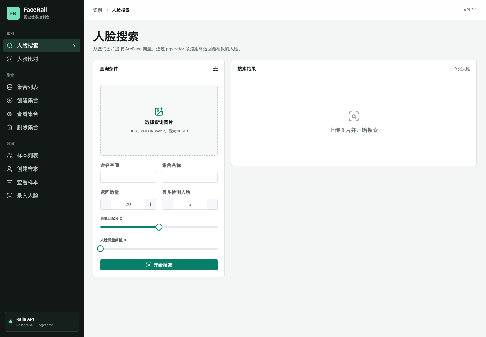

# FaceRail

[](https://github.com/LeeWlving/FaceRail/actions/workflows/ci.yml)

FaceRail 是一个可自行部署的人脸数据管理与向量检索系统。它使用 Rails 提供兼容 Face Search 2.1 的 API，通过 SCRFD 检测人脸、ArcFace 生成 512 维特征向量，并由 PostgreSQL 与 pgvector 完成余弦相似度搜索。Vue 3 控制台提供集合、样本、人脸录入、M:N 搜索和 1:1 比对界面。



## 核心能力

- 管理命名空间、集合、自定义样本字段和人脸字段
- 创建、更新和删除身份样本
- 上传图片并异步生成人脸 embedding
- 在单张查询图中检测多张人脸
- 使用 pgvector 返回默认 Top 20 相似人脸
- 对两张图片执行 1:1 人脸比对
- 查看 embedding 的等待、处理中、可搜索和失败状态
- 使用 Active Storage 管理原图与人脸裁剪图
- 中英文界面即时切换
- 在设备端与云端推理之间切换，默认使用设备端

## 系统架构

```text
Browser (default: on-device SCRFD + ArcFace)
  |                    |
  | embeddings         | cloud mode: images
  v                    v
Vue 3 + Vite ------> Ruby on Rails API
  |--------------------------|
  v                          v
Active Storage          Solid Queue worker
                             |
                             v
                    ruby-vips preprocessing
                             |
                             v
                       SCRFD detection
                             |
                             v
                      ArcFace embedding
                             |
                             v
                  PostgreSQL 17 + pgvector

Device: query image -> browser SCRFD -> browser ArcFace -> embedding -> pgvector -> Top 20
Cloud:  query image -> Rails SCRFD -> Rails ArcFace -> embedding -> pgvector -> Top 20
```

## 技术栈

| 层级 | 技术 |
| --- | --- |
| 前端 | Vue 3、Vite、Vue Router、Vue I18n、Element Plus、Axios |
| API | Ruby 4、Rails 8 API mode |
| 数据库 | PostgreSQL 17、pgvector、HNSW cosine index |
| 图片 | Active Storage、ruby-vips |
| 推理 | ONNX Runtime Web / Ruby、SCRFD、ArcFace |
| 异步任务 | Active Job、Solid Queue |
| 发布 | Docker、Nginx、GitHub Actions、GHCR |

## 目录结构

```text
FaceRail/
├── face-backends/          Rails API、模型推理和后台任务
├── face-frontends/         Vue 3 管理控制台
├── .github/workflows/      CI 与 GHCR 镜像发布
├── compose.yml             完整生产拓扑
├── Dockerfile              后端镜像
└── .env.example            Compose 环境变量示例
```

`face-search/` 仅作为本地参考实现使用，已被 Git 忽略，不属于发布产物。

## 本地开发

### 环境要求

- Ruby 4.0.5
- Node.js 20.19 或更高版本
- PostgreSQL 17 与 pgvector
- libvips
- 两个 ONNX 模型文件

macOS 可以通过 Homebrew 安装系统依赖：

```bash
brew install postgresql@17 pgvector vips
brew services start postgresql@17
```

### 准备模型

将模型放到 `face-backends/storage/models/`：

```text
scrfd_500m_bnkps.onnx
glint360k_cosface_r18_fp16_0.1.onnx
```

如果本机同时保留了原始 `face-search` 项目，可以直接复制：

```bash
cd face-backends
bin/rails face_models:install
```

也可以通过以下环境变量使用其他位置：

```bash
FACE_DETECTION_MODEL_PATH=/path/to/scrfd.onnx
FACE_RECOGNITION_MODEL_PATH=/path/to/arcface.onnx
```

### 启动后端

```bash
cd face-backends
bundle config set --local path vendor/bundle
bundle install
bin/rails db:prepare
bin/rails server -p 8080
```

另开一个终端启动 embedding worker：

```bash
cd face-backends
bin/jobs
```

### 启动前端

```bash
cd face-frontends
npm ci
npm run dev
```

开发地址：

- 前端：`http://127.0.0.1:5173`
- Rails API：`http://127.0.0.1:8080`
- 健康检查：`http://127.0.0.1:8080/up`

Vite 会将 `/api` 请求代理到本地 Rails 服务。通过 `VITE_API_BASE_URL` 可以覆盖 API 根路径。

### 推理模式与隐私

控制台右上角可以在“设备端”和“云端”之间切换，选择会保存在浏览器中，默认是设备端：

- **设备端搜索**：浏览器运行 SCRFD 和 ArcFace，只将 512 维向量、人脸位置和质量分发送给 Rails；查询原图不离开设备。
- **设备端比对**：检测、向量提取和相似度计算全部在浏览器完成，不上传图片或向量。
- **设备端录入**：浏览器生成向量；仅当集合启用“保留人脸图片”时上传 112×112 对齐人脸图，原始图片不上传。
- **云端模式**：完整保留原有搜索、比对和录入流程，图片由 Rails、ruby-vips 和 ONNX Runtime 处理，录入任务通过 Solid Queue 异步执行。

设备端首次使用时会从 Rails 下载 SCRFD 和 ArcFace 模型，后续由浏览器缓存复用。界面支持中文和英文即时切换。

## API

所有响应都使用兼容格式：

```json
{
  "code": 0,
  "message": "",
  "data": {}
}
```

主要接口：

| 功能 | 方法 | 路径 |
| --- | --- | --- |
| 集合管理 | GET/POST | `/api/visual/collect/*` |
| 样本管理 | GET/POST | `/api/visual/sample/*` |
| 人脸管理 | GET/POST | `/api/visual/face/*` |
| M:N 搜索 | POST | `/api/visual/search/do` |
| embedding 搜索 | POST | `/api/visual/search/embedding` |
| 1:1 比对 | POST | `/api/visual/compare/do` |
| embedding 录入 | POST | `/api/visual/face/create_embedding` |
| 浏览器模型 | GET | `/api/models/scrfd`、`/api/models/arcface` |

完整接口契约见 [`face-frontends/docs/2.1.0.md`](face-frontends/docs/2.1.0.md)。服务同时保留不带 `/api` 前缀的 `/visual/...` 兼容路径。

## Docker 部署

GitHub Actions 会发布两张 `linux/amd64` 镜像：

- `ghcr.io/leewlving/facerail-backend:latest`
- `ghcr.io/leewlving/facerail-frontend:latest`

准备部署配置和模型：

```bash
cp .env.example .env
mkdir -p models
cp /path/to/scrfd_500m_bnkps.onnx models/
cp /path/to/glint360k_cosface_r18_fp16_0.1.onnx models/
```

在 `.env` 中设置强密码及 Rails 密钥。Rails 密钥可以这样生成：

```bash
cd face-backends
bin/rails secret
```

启动 PostgreSQL、API、worker 和前端：

```bash
docker compose pull
docker compose up -d
docker compose ps
```

默认入口为 `http://localhost`，API 也会映射到 `http://localhost:8080`。上传文件和 PostgreSQL 数据保存在命名卷中，模型以只读方式挂载。

如 GHCR 包尚未设置为公开，需要先使用具有 `read:packages` 权限的令牌登录：

```bash
echo "$GITHUB_TOKEN" | docker login ghcr.io -u USERNAME --password-stdin
```

### 本地构建镜像

```bash
docker build -t facerail-backend -f Dockerfile .
docker build -t facerail-frontend -f face-frontends/Dockerfile face-frontends
```

## CI/CD

每次提交到 `main` 都会依次执行：

1. Brakeman 与 Bundler Audit 安全扫描
2. RuboCop 后端代码检查
3. PostgreSQL + pgvector 集成测试
4. 前端 ESLint 与 Vite 生产构建
5. 所有检查通过后构建并推送 backend/frontend 镜像到 GHCR

镜像同时带有 `latest` 和 `sha-<commit>` 标签，并生成 provenance 与 SBOM。Pull Request 只运行检查，不发布镜像。

## 本地验证

后端：

```bash
cd face-backends
bin/rails test
bin/rails zeitwerk:check
bin/rubocop
bin/brakeman --no-pager
```

前端：

```bash
cd face-frontends
npm run lint
npm run build
npm run test:visual
```
